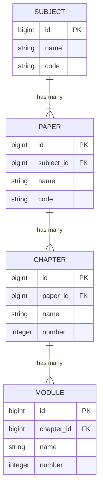

# Academic Structure Database Schema

This document details the hierarchical relationships between Subjects, Papers, Chapters, and Modules in the LightForge Academy LMS.

## 📊 Entity Relationship Diagram (ERD)



---

## 🔗 Hierarchy Breakdown

The structure follows a strictly nested parent-child hierarchy. Deleting a parent record cascades the deletion to all its children (e.g., deleting a Subject deletes all its Papers, Chapters, and Modules).

### 1. Subject (Root Level)
*   **Description:** The top-level academic discipline.
*   **Table:** `subjects`
*   **Key Columns:**
    *   `id`: Primary Key
    *   `name`: Name of the subject (e.g., "Physics")
    *   `code`: Unique identifier (e.g., "PHY")

### 2. Paper (Child of Subject)
*   **Description:** A specific division of a subject.
*   **Table:** `papers`
*   **Relationship:** Belongs to **Subject** (`subject_id`).
*   **Key Columns:**
    *   `id`: Primary Key
    *   `subject_id`: Foreign Key linking to `subjects` table.
    *   `name`: Name of the paper (e.g., "Physics 1st Paper")

### 3. Chapter (Child of Paper)
*   **Description:** A major topic unit within a paper.
*   **Table:** `chapters`
*   **Relationship:** Belongs to **Paper** (`paper_id`).
*   **Key Columns:**
    *   `id`: Primary Key
    *   `paper_id`: Foreign Key linking to `papers` table.
    *   `name`: Chapter title (e.g., "Thermodynamics")
    *   `number`: Sequential ordering number (e.g., 1).

### 4. Module (Child of Chapter)
*   **Description:** The smallest granular learning unit within a chapter.
*   **Table:** `modules`
*   **Relationship:** Belongs to **Chapter** (`chapter_id`).
*   **Key Columns:**
    *   `id`: Primary Key
    *   `chapter_id`: Foreign Key linking to `chapters` table.
    *   `name`: Module title (e.g., "Laws of Thermodynamics")
    *   `number`: Sequential ordering number.

---

## 💻 Code Implementation

### Migration Foreign Keys
The relationships are enforced at the database level using foreign keys with cascading deletes.

**Papers Table Migration:**
```php
$table->foreignId('subject_id')->constrained()->onDelete('cascade');
```

**Chapters Table Migration:**
```php
$table->foreignId('paper_id')->constrained()->onDelete('cascade');
```

**Modules Table Migration:**
```php
$table->foreignId('chapter_id')->constrained()->onDelete('cascade');
```

### Eloquent Models
Laravel models define the navigation logic between these entities.

**Subject Model (`App\Models\Subject`)**
```php
public function papers() {
    return $this->hasMany(Paper::class);
}
```

**Paper Model (`App\Models\Paper`)**
```php
public function subject() {
    return $this->belongsTo(Subject::class);
}
public function chapters() {
    return $this->hasMany(Chapter::class);
}
```

**Chapter Model (`App\Models\Chapter`)**
```php
public function paper() {
    return $this->belongsTo(Paper::class);
}
public function modules() {
    return $this->hasMany(Module::class);
}
```

**Module Model (`App\Models\Module`)**
```php
public function chapter() {
    return $this->belongsTo(Chapter::class);
}
```

---

## 📝 Practical Data Example

| Level | Name | ID | Parent ID |
| :--- | :--- | :--- | :--- |
| **Subject** | **Chemistry** | `1` | `null` |
| **Paper** | Chemistry 1st Paper | `10` | `subject_id: 1` |
| **Chapter** | Qualitative Chemistry | `100` | `paper_id: 10` |
| **Module** | Solubility Product | `500` | `chapter_id: 100` |
| **Module** | Ion Identification | `501` | `chapter_id: 100` |
